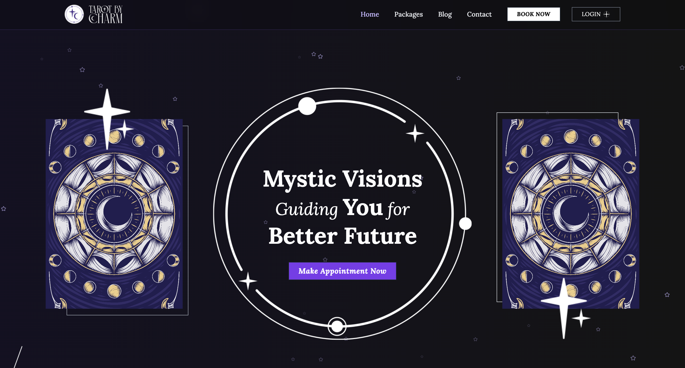

# Future Advice by Charm - Professional Tarot Reading Platform

A modern, responsive web application for professional tarot reading services. Built with React, Vite, and Tailwind CSS, featuring user authentication, appointment booking, blog management, comprehensive SEO optimization, and full PWA (Progressive Web App) support with service workers.



## 🌟 Features

### Core Functionality

- **User Authentication** - Secure login/register with Google OAuth support
- **Appointment Booking** - Interactive calendar selection and booking system
- **Package Management** - Browse and select tarot reading packages
- **Blog System** - Read and save tarot-related articles and insights
- **User Dashboard** - Manage bookings, profile, and saved posts
- **Responsive Design** - Optimized for all devices and screen sizes

### PWA & Service Worker Features

- **Offline Support** - Access cached content without internet connection
- **App Installation** - Install as native app on mobile devices
- **Push Notifications** - Receive updates and notifications
- **Background Sync** - Sync data when connection is restored
- **Cache Management** - Intelligent caching for better performance
- **Update Management** - Automatic app updates with user notification

### SEO & Performance

- **Comprehensive SEO** - Meta tags, structured data, and sitemap
- **PWA Support** - Web app manifest and mobile optimization
- **Fast Loading** - Optimized with Vite and performance best practices
- **Search Engine Friendly** - XML sitemap and robots.txt

### Technical Features

- **Modern Stack** - React 18, Vite, Tailwind CSS
- **State Management** - Redux Toolkit for global state
- **UI Components** - Custom component library with Radix UI
- **Form Handling** - React Hook Form with validation
- **Animations** - Framer Motion for smooth interactions
- **Routing** - React Router with protected routes

## 🚀 Quick Start

### Prerequisites

- Node.js (v18 or higher)
- npm or yarn

### Installation

1. **Clone the repository**

   ```bash
   git clone <repository-url>
   cd <respository>
   ```

2. **Install dependencies**

   ```bash
   npm install
   ```

3. **Start development server**

   ```bash
   npm run dev
   ```

4. **Open your browser**
   Navigate to `http://localhost:3000`

### Build for Production

```bash
npm run build
npm run preview
```

## 📁 Project Structure

```
front_tarot/
├── public/
│   ├── sitemap.xml          # SEO sitemap
│   ├── robots.txt           # Search engine guidance
│   ├── manifest.json        # PWA manifest
│   └── assets/              # Static assets
├── src/
│   ├── components/          # Reusable components
│   │   ├── SEO.jsx         # SEO management component
│   │   ├── ui/             # UI component library
│   │   └── routes/         # Route protection components
│   ├── Pages/              # Page components
│   │   ├── Auth/           # Authentication pages
│   │   ├── Booking/        # Appointment booking
│   │   ├── Blogs/          # Blog system
│   │   ├── Home/           # Homepage components
│   │   ├── Packages/       # Package management
│   │   ├── User/           # User dashboard
│   │   └── Contact/        # Contact page
│   ├── context/            # React context providers
│   ├── hooks/              # Custom React hooks
│   ├── lib/                # Utility libraries
│   ├── redux/              # Redux store and slices
│   └── utils/              # API and utility functions
├── index.html              # Main HTML file with SEO meta tags
└── package.json            # Dependencies and scripts
```

## 🛠️ Technology Stack

### Frontend

- **React 18** - Modern React with hooks
- **Vite** - Fast build tool and dev server
- **Tailwind CSS** - Utility-first CSS framework
- **Framer Motion** - Animation library
- **React Router** - Client-side routing

### State Management

- **Redux Toolkit** - Global state management
- **React Context** - Local state management

### UI & Components

- **Radix UI** - Accessible component primitives
- **Lucide React** - Icon library
- **React Hook Form** - Form handling and validation
- **Yup** - Schema validation

### Development Tools

- **ESLint** - Code linting
- **PostCSS** - CSS processing
- **Autoprefixer** - CSS vendor prefixes

## 📱 Pages & Features

### Public Pages

- **Homepage** - Landing page with hero section and services
- **Packages** - Browse tarot reading packages
- **Blog** - Read tarot articles and insights
- **Contact** - Contact form and information
- **Login/Register** - User authentication

### Protected Pages

- **Appointment Booking** - Calendar selection and booking form
- **User Dashboard** - Profile management and booking history
- **Saved Posts** - Bookmarked blog articles
- **Payment** - Secure payment processing

## 🔧 Configuration

### Environment Variables

Create a `.env` file in the root directory:

```env
VITE_API_URL=your_api_url
VITE_GOOGLE_CLIENT_ID=your_google_oauth_client_id
VITE_VAPID_PUBLIC_KEY=your_vapid_public_key_for_push_notifications
```

### PWA Configuration

The project includes comprehensive PWA features:

- **Service Worker** - Custom service worker for offline functionality
- **App Manifest** - PWA manifest for app installation
- **Cache Strategies** - Intelligent caching for different content types
- **Background Sync** - Offline data synchronization
- **Push Notifications** - Real-time notifications (requires VAPID keys)

## 🔄 Service Worker Implementation

### Features

- **Offline Caching** - Cache static assets and API responses
- **Network First Strategy** - Serve cached content when offline
- **Background Sync** - Sync data when connection is restored
- **Push Notifications** - Handle push notification events
- **Update Management** - Notify users of app updates

### Components

- `src/components/ServiceWorkerRegistration.jsx` - Service worker registration
- `src/components/OfflineFallback.jsx` - Offline status indicator
- `src/components/PWAInstallPrompt.jsx` - App installation prompt
- `src/components/PWASettings.jsx` - PWA settings management
- `src/components/OfflinePage.jsx` - Offline page component
- `src/hooks/useServiceWorker.js` - Service worker hook with toast integration
- `src/utils/backgroundSync.js` - Background sync utilities

### Cache Strategies

```javascript
// Static assets (images, fonts, CSS, JS)
CacheFirst - Serve from cache, update in background

// API requests
NetworkFirst - Try network, fallback to cache

// Navigation requests
NetworkFirst - Try network, fallback to cached page
```

### Usage Examples

```jsx
// Service worker registration (automatic)
<ServiceWorkerRegistration />

// Offline status indicator
<OfflineFallback />

// App installation prompt
<PWAInstallPrompt />

// PWA settings management
<PWASettings />
```

### Background Sync

```javascript
import { backgroundSync } from "../utils/backgroundSync";

// Register background sync
await backgroundSync.registerSync("appointment-sync", {
  appointmentId: "123",
  data: appointmentData,
});
```

### Push Notifications

```javascript
import { pushNotifications } from "../utils/backgroundSync";

// Request permission and subscribe
const granted = await pushNotifications.requestPermission();
if (granted) {
  const subscription = await pushNotifications.subscribeToPush();
}
```

## 📊 SEO Implementation

### Files Added

- `public/sitemap.xml` - Complete sitemap with all pages
- `public/robots.txt` - Search engine crawling rules
- `public/manifest.json` - PWA manifest file
- `src/components/SEO.jsx` - Reusable SEO component

### Usage Example

```jsx
import SEO from "../../components/SEO";

const MyPage = () => {
  return (
    <>
      <SEO title="Page Title" description="Page description" url="/page-url" />
      {/* Your page content */}
    </>
  );
};
```

## 🎨 Styling

### Tailwind CSS

The project uses Tailwind CSS with custom configuration:

- **Custom Colors** - Brand-specific color palette
- **Responsive Design** - Mobile-first approach
- **Component Classes** - Reusable utility classes
- **Dark Mode** - Theme support (if needed)

### Custom Components

- **Button Components** - Primary, secondary, and ghost buttons
- **Card Components** - Blog cards, package cards
- **Form Components** - Inputs, selects, checkboxes
- **Modal Components** - Custom modal dialogs

## 🔐 Authentication

### Features

- **JWT Tokens** - Secure authentication
- **Google OAuth** - Social login integration
- **Protected Routes** - Route-based access control
- **User Context** - Global user state management

### Route Protection

```jsx
// Public routes (redirect if authenticated)
<PubliceRoute>
  <Login />
</PubliceRoute>

// Private routes (redirect if not authenticated)
<PrivateRoute>
  <Dashboard />
</PrivateRoute>
```

## 📅 Appointment System

### Features

- **Calendar Selection** - Interactive date/time picker
- **Package Selection** - Choose from available packages
- **Booking Confirmation** - Appointment slip generation
- **Payment Integration** - Secure payment processing

## 📝 Blog System

### Features

- **Article Management** - Read and browse articles
- **Search Functionality** - Find specific articles
- **Save Posts** - Bookmark favorite articles
- **Responsive Layout** - Optimized for all devices

## 🚀 Deployment

### Build Process

```bash
npm run build
```

### Deployment Options

- **Vercel** - Recommended for React apps
- **Netlify** - Easy deployment with Git integration
- **AWS S3** - Static hosting with CloudFront
- **Firebase Hosting** - Google's hosting solution

### Environment Setup

1. Set production environment variables
2. Update API endpoints
3. Configure domain and SSL
4. Submit sitemap to Google Search Console

## 📈 Performance

### Optimizations

- **Code Splitting** - Lazy loading of components
- **Image Optimization** - Optimized image loading
- **Bundle Analysis** - Monitor bundle size
- **Caching** - Browser and CDN caching

### Core Web Vitals

- **LCP** - Largest Contentful Paint
- **FID** - First Input Delay
- **CLS** - Cumulative Layout Shift

## 🤝 Contributing

### Development Workflow

1. Fork the repository
2. Create a feature branch
3. Make your changes
4. Add tests if applicable
5. Submit a pull request

### Code Style

- Follow ESLint rules
- Use Prettier for formatting
- Write meaningful commit messages
- Add comments for complex logic

## 📄 License

This project is licensed under the MIT License - see the [LICENSE](LICENSE) file for details.

## 📞 Support

For support and questions:

- **Email**: shinthant234223@gmail.com
- **Website**: https://futureadvicebycharm.com
- **Developer**: ZeroOnee Tech

## 🙏 Acknowledgments

- **React Team** - For the amazing framework
- **Vite Team** - For the fast build tool
- **Tailwind CSS** - For the utility-first CSS framework
- **Radix UI** - For accessible components

---

**Built with ❤️ by ZeroOnee Tech**

_Last updated: December 19, 2024_
